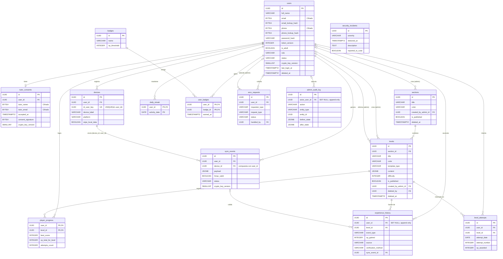

**Conceptos y Tecnologías Base:** [[Proyecto de la USBI]], [[Requisitos - USBI]], [[Diccionario de datos - PostgreSQL On-Premise]], [[Base de datos cloud - PostgreSQL]]

# Modelo Relacional (Entity-Relationship) - PostgreSQL On-Premise

A continuación, se presenta la arquitectura relacional de las 15 tablas maestras del sistema, reflejando el diseño estricto de privacidad, auditoría y separación funcional.

