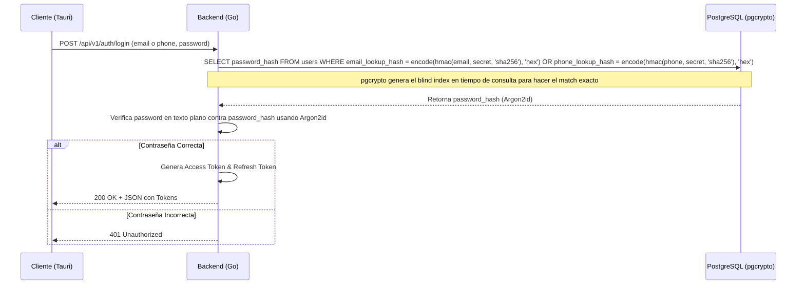

# Fase 2: Core del Backend, Autenticación y Seguridad

## Checklist de Infraestructura y Configuración Inicial
- [ ] Configura el enrutador HTTP usando la librería `go-chi/chi/v5` en `backend/internal/handlers/`.
- [ ] Instancia explícitamente el servidor en `backend/cmd/server/main.go` con `&http.Server{Addr: ":8080", Handler: r}`.
- [ ] Implementa `LoggerMiddleware` en `backend/internal/middleware/` para registrar `Method`, `Path`, `IP` y `Duration`.
- [ ] Omite estrictamente los payloads sensibles en los logs.
- [ ] Implementa `RecoverMiddleware` en `backend/internal/middleware/` para prevenir caídas del servidor ante panics.
- [ ] Implementa Rate Limiting (ej. con `go-chi/httprate`) de **10 req/min por IP** exclusivamente para el endpoint `/api/v1/auth/login` para prevenir ataques de fuerza bruta.
- [ ] Implementa `CORSMiddleware` en `backend/internal/middleware/` para restringir y validar orígenes permitidos de clientes Tauri (`tauri://localhost`).
- [ ] Inyecta las cabeceras de seguridad `X-Frame-Options: DENY`, `Strict-Transport-Security` y `X-Content-Type-Options: nosniff` usando `SecurityHeaders` middleware.
- [ ] Remueve y descarta cualquier referencia heredada a Electron o PouchDB en toda la configuración de la infraestructura.

> [!CAUTION]
> No registres contraseñas ni tokens JWT en los logs del servidor bajo ninguna circunstancia.

## Checklist de Seguridad y Criptografía
- [ ] Implementa el hashing de contraseñas utilizando `golang.org/x/crypto/argon2`.
- [ ] Define la función `func HashPassword(password string) (string, error)` configurada con 3 iteraciones, 64MB de memoria y paralelismo en 1.
- [ ] Define la función `func VerifyPassword(password, hash string) (bool, error)`.
- [ ] Utiliza `pgcrypto` en PostgreSQL para la generación y validación de *blind indexes* (`email_lookup_hash` y `phone_lookup_hash`), garantizando anonimato en la base de datos y previniendo fugas.
- [ ] Implementa la generación y validación de JSON Web Tokens mediante `golang-jwt/jwt/v5`.
- [ ] Incluye en el payload JWT los campos: `sub` (user_id), `role`, `token_version` y `exp`.
- [ ] Configura una duración estricta de 15 minutos para los Access Tokens.
- [ ] Configura una duración de 7 días para los Refresh Tokens.
- [ ] Valida el campo `token_version` del JWT contra PostgreSQL en cada petición protegida.
- [ ] Implementa el endpoint de **Logout** (`POST /api/v1/auth/logout`) que incrementa el `token_version` del usuario en PostgreSQL (`UPDATE users SET token_version = token_version + 1`) para invalidar todos los tokens JWT emitidos previamente.
- [ ] Implementa la **Rutina ARCO** para Cancelación/Pseudonimización de cuentas, que ejecute una purga de datos operativos mediante `ON DELETE CASCADE` y anonimice logs usando `ON DELETE SET NULL`.

## Checklist de Control de Acceso (RBAC)
- [ ] Implementa el middleware `RequireRole(roles ...string)`.
- [ ] Extrae y parsea el JWT desde el contexto de la petición validando el formato `Authorization: Bearer <token>`.
- [ ] Comprueba que el rol del JWT coincida con alguno de los roles permitidos (ej. `player`, `admin`).
- [ ] Rechaza la petición devolviendo un estado HTTP 403 si el usuario carece del rol necesario.

## Diagrama de Secuencia: Flujo de Login con pgcrypto Blind Index y Argon2



## Contratos API (Request/Response JSON y Headers)

### Endpoint de Registro (`POST /api/v1/auth/register`)
- [ ] Expón el endpoint de registro asegurando el siguiente contrato exacto:

**Headers Requeridos:**
- `Content-Type: application/json`

**Request (Esquema JSON):**
```json
{
  "type": "object",
  "properties": {
    "email": { "type": "string", "format": "email", "maxLength": 100 },
    "phone": { "type": "string", "maxLength": 20 },
    "password": { "type": "string", "minLength": 8 }
  },
  "anyOf": [
    { "required": ["email", "password"] },
    { "required": ["phone", "password"] }
  ]
}
```

**Response Éxito (HTTP 201):**
```json
{
  "status": "success",
  "data": {
    "userId": "uuid",
    "role": "player",
    "createdAt": "2023-10-25T12:00:00Z"
  }
}
```

### Flujo de Consentimiento de Tutor (Menores de Edad)
- [ ] Si la variable `isAdult` es falsa durante el registro, se asienta en la base de datos el estado `pending_tutor_consent` para el usuario y se inyecta un registro en `tutor_consents` asociado al `user_id`. (RF3)

### Endpoint de Login (`POST /api/v1/auth/login`)
- [ ] Expón el endpoint de inicio de sesión asegurando el siguiente contrato exacto:

**Headers Requeridos:**
- `Content-Type: application/json`

**Request (Esquema JSON):**
```json
{
  "type": "object",
  "properties": {
    "email": { "type": "string", "format": "email", "maxLength": 100 },
    "phone": { "type": "string", "maxLength": 20 },
    "password": { "type": "string", "minLength": 8 }
  },
  "anyOf": [
    { "required": ["email", "password"] },
    { "required": ["phone", "password"] }
  ]
}
```

**Response Éxito (HTTP 200):**
```json
{
  "status": "success",
  "data": {
    "accessToken": "eyJhbGciOiJIUzI1NiIsInR5c...",
    "refreshToken": "def502005a30eb6080...",
    "expiresIn": 900
  }
}
```

### Endpoint de Refresh (`POST /api/v1/auth/refresh`)
- [ ] Expón el endpoint de renovación de token asegurando el siguiente contrato:

**Headers Requeridos:**
- `Content-Type: application/json`

**Request (Esquema JSON):**
```json
{
  "type": "object",
  "properties": {
    "refreshToken": { "type": "string" }
  },
  "required": ["refreshToken"]
}
```

**Response Éxito (HTTP 200):**
```json
{
  "status": "success",
  "data": {
    "accessToken": "eyJhbGciOiJIUzI1NiIsInR5c...",
    "expiresIn": 900
  }
}
```

## Anexos Técnicos

### Anexo A: Queries de SQL Críticas

**Registro de Usuario integrando pgcrypto (Blind Index):**
```sql
BEGIN;

INSERT INTO users (
    id, 
    email_lookup_hash, 
    phone_lookup_hash, 
    password_hash, 
    role
) VALUES (
    gen_random_uuid(), 
    encode(hmac($1, current_setting('app.hmac_secret'), 'sha256'), 'hex'), 
    encode(hmac($2, current_setting('app.hmac_secret'), 'sha256'), 'hex'), 
    $3, -- Hash generado en Go mediante Argon2
    'player'
) RETURNING id INTO v_user_id;

COMMIT;
```

**Extracción del Hash de Contraseña en Login:**
```sql
SELECT id, password_hash, role 
FROM users 
WHERE email_lookup_hash = encode(hmac($1, current_setting('app.hmac_secret'), 'sha256'), 'hex')
   OR phone_lookup_hash = encode(hmac($2, current_setting('app.hmac_secret'), 'sha256'), 'hex');
```

### Anexo B: Snippets y Boilerplates Críticos

> [!CAUTION]
> Asegura la limpieza estricta de memoria para arrays de bytes que contengan contraseñas en texto plano.

**Prevención de Fugas en Hashing/Verificación de Contraseñas (Go):**
```go
package crypto

import (
	"crypto/subtle"
	"encoding/base64"
	"errors"
	"strings"
	"golang.org/x/crypto/argon2"
)

// VerifyPassword valida el intento de login contra un hash de Argon2id
func VerifyPassword(passwordBytes []byte, encodedHash string) (bool, error) {
    // Asegura la limpieza de memoria del password en texto plano al terminar la función
    defer func() {
        for i := range passwordBytes {
            passwordBytes[i] = 0
        }
    }()

    parts := strings.Split(encodedHash, "$")
    if len(parts) != 6 {
        return false, errors.New("formato de hash inválido")
    }

    salt, err := base64.RawStdEncoding.DecodeString(parts[4])
    if err != nil {
        return false, err
    }

    decodedHash, err := base64.RawStdEncoding.DecodeString(parts[5])
    if err != nil {
        return false, err
    }

    comparisonHash := argon2.IDKey(passwordBytes, salt, 3, 64*1024, 1, 32)
    
    if subtle.ConstantTimeCompare(decodedHash, comparisonHash) == 1 {
        return true, nil
    }
    
    return false, nil
}
```

**Limpieza de Memoria Estricta en el Frontend (Phaser + Tauri):**
```javascript
// Boilerplate: Destrucción de instancia Phaser y limpieza de memoria en Tauri al hacer logout
function secureLogout() {
    // 1. Limpieza de memoria en el motor de juego (Phaser)
    if (window.game) {
        window.game.destroy(true, false);
        window.game = null;
    }
    
    // 2. Limpieza de variables sensibles
    let sensitiveToken = null;
    
    // 3. Invoca la purga de credenciales seguras vía Tauri (SQLite/Store)
    if (window.__TAURI__) {
        window.__TAURI__.invoke('purge_secure_session')
            .then(() => console.log("Sesión local destruida de forma segura."))
            .catch(console.error);
    }
}
```
