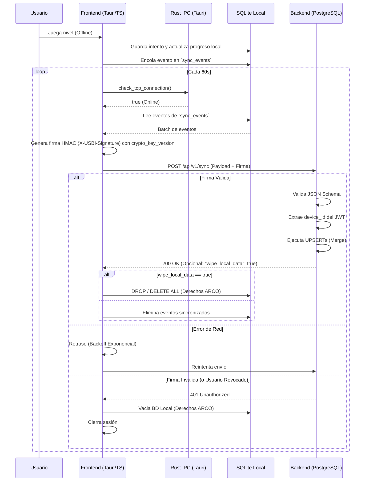

# Fase 4: Sincronización Offline y Tauri - Especificación Accionable

## 1. Configuración de Tauri e IPC (Rust <-> TS)
- [ ] CONFIGURA `tauri.conf.json` definiendo `productName: "USBI Aprende"` e `identifier: "com.usbi.aprende"`.
- [ ] ESTABLECE permisos IPC estrictos para permitir acceso únicamente al plugin de SQLite y HTTP/Network.
- [ ] REGISTRA el contrato IPC (Rust <-> TS) para verificar conectividad TCP real (Ver Anexo Técnico A).
- [ ] INVOCA el comando IPC en el frontend usando el API de Tauri para comprobar el estado de conexión online.

## 2. Base de Datos Local y Mecanismo de Semilla (SQLite)
- [ ] CONFIGURA la ruta de la base de datos apuntando al AppData del SO (`%APPDATA%/com.usbi.aprende/local.db`).
- [ ] OBTÉN el `device_id` válido al momento del Login en el cliente Tauri a partir de la respuesta del servidor.
- [ ] ALMACENA este `device_id` localmente en SQLite (tabla `local_config`) para utilizarlo como parte de claves primarias compuestas y rastreo de eventos.
- [ ] IMPLEMENTA el Mecanismo de Semilla (Seed) inyectando de forma segura la variable `crypto_key_version` al crear la base de datos local para validación y firma.
- [ ] IMPLEMENTA el manejo de migraciones locales mediante `PRAGMA user_version` ejecutando el boilerplate de inicialización (Ver Anexo Técnico B).
- [ ] IMPLEMENTA la persistencia de progreso ejecutando las consultas SQL exactas para inserción y colas de sincronización (Ver Anexo Técnico C).

## 3. Worker de Sincronización
- [ ] CREA el hook `useSyncWorker.ts` o Worker dedicado.
- [ ] EJECUTA un Ping TCP (`std::net::TcpStream` en Rust, Timeout: 3s) cada 60 segundos. Retorna Booleano al Frontend.
- [ ] PROCEDE con la subida de datos en lote (`sync_events`) sólo si la conexión TCP retorna `true`.
- [ ] MANEJA las respuestas del servidor para la cola de sincronización (Dead Letter Queue & Retries):
  - [ ] Si HTTP 200 (OK): Vacía la tabla `sync_events` local de los eventos confirmados.
  - [ ] Si HTTP 400 (Bad Request): Extrae y descarta el evento corrupto de `sync_events` para evitar bucles infinitos.
  - [ ] Si HTTP 401 (Unauthorized): Ejecuta el protocolo ARCO Wipe (Vaciado completo de DB local).
  - [ ] Si Error de Red TCP o Timeout: Aplica Backoff Exponencial (1s, 2s, 4s, hasta max_retries=5) antes del próximo intento.
- [ ] FIRMA el payload para validación anti-trampa con HMAC SHA-256 (Ver Anexo Técnico D).

## 4. Mapeo de Payload y Autenticación (Backend)
- [ ] PRECONDICIÓN: Validar JWT, extraer `user_id` y `device_id` y regenerar/validar firma HMAC SHA-256.
- [ ] DECODIFICA el payload polimórfico en string utilizando validación estricta Zod/Validator para asegurar tipos (e.g., `events` array).
- [ ] INSERTA historiales usando un Generador UUIDv7 certificado (e.g. `uuid` crate con features `v7` en Rust, o equivalente en Go) para `experience_history`.
- [ ] MAPEA el `device_id` extraído del JWT hacia `sync_events.device_id` en la inserción final.

## 5. Sincronización Inversa y Derechos ARCO (Wipe Local Data)
- [ ] INTERCEPTA las respuestas del servidor en el frontend.
- [ ] EJECUTA el vaciado de la base de datos local (Borrado de tablas `local_player_progress` y `sync_events`) si el backend responde con un HTTP 401.
- [ ] EJECUTA el vaciado de la base de datos local si el payload del servidor incluye la directiva explícita `"wipe_local_data": true`, garantizando el cumplimiento de los Derechos ARCO (Derecho de Cancelación/Oposición).

## 6. Backend: Endpoint de Sincronización (PostgreSQL)
- [ ] HABILITA el endpoint `POST /api/v1/sync` en el backend.
- [ ] VERIFICA la firma HMAC regenerándola con el `APP_SECRET` del backend.
- [ ] RECHAZA la petición con estado 401 si la firma no coincide con el header `X-USBI-Signature` (lo cual detonará la sincronización inversa y borrado local).
- [ ] VALIDA el payload de entrada contra el JSON Schema exacto (Ver Anexo Técnico E).
- [ ] APLICA el Merge Multidispositivo en PostgreSQL ejecutando las transacciones UPSERT exactas (Ver Anexo Técnico F).
- [ ] RESPONDE un código 200 OK con el estado final actualizado tras aplicar las transacciones.

## 7. Diagrama de Flujo de Sincronización Offline
- [ ] REVISA e implementa la lógica de sincronización basada en el siguiente diagrama de secuencia:



## Anexos Técnicos

### Anexo Técnico A: Contrato IPC para TCP Ping
## 4. Estado de Conexión (Ping TCP Híbrido)

- [ ] **Módulo Rust (Tauri Core)**: Implementa un hilo secundario asíncrono con `tokio::spawn` que haga un TCP Ping al backend cada 60 segundos. NO usar WebWorkers en JS. El hilo de Rust debe inyectar el evento `app.emit_all("tcp://online")` o `app.emit_all("tcp://offline")` al Webview de Tauri, previniendo el congelamiento del UI thread.
```rust
// src-tauri/src/main.rs
#[tauri::command]
fn start_tcp_ping(app_handle: tauri::AppHandle) {
    tauri::async_runtime::spawn(async move {
        loop {
            // Ping TCP asíncrono para verificar conectividad real
            match tokio::net::TcpStream::connect("usbi.edu.mx:443").await {
                Ok(_) => { let _ = app_handle.emit_all("tcp://online", ()); },
                Err(_) => { let _ = app_handle.emit_all("tcp://offline", ()); },
            }
            tokio::time::sleep(std::time::Duration::from_secs(60)).await;
        }
    });
}
```
Invocación en Frontend:
```typescript
import { invoke } from '@tauri-apps/api/core';
const isOnline = await invoke<boolean>('check_tcp_connection');
```

### Anexo Técnico B: Checklist de Inicialización de SQLite y Mecanismo Seed
- [ ] **1. Cargar Base de Datos**: Inicializa la conexión SQLite en `%APPDATA%/com.usbi.aprende/local.db`.
- [ ] **2. Obtener Versión**: Ejecuta `PRAGMA user_version;` para comprobar migraciones pendientes.
- [ ] **3. Migración v1 - Tablas Core**: Si la versión es 0, ejecutar la creación de tablas:
  - `local_config` (key TEXT PRIMARY KEY, value TEXT NOT NULL)
  - `local_users` (id TEXT PRIMARY KEY, alias TEXT NOT NULL, email_hash TEXT NOT NULL)
  - `local_player_progress` (id TEXT PRIMARY KEY, user_id TEXT NOT NULL, level_id TEXT NOT NULL, best_score INTEGER NOT NULL DEFAULT 0, xp_total_for_level INTEGER NOT NULL DEFAULT 0, synced BOOLEAN NOT NULL DEFAULT 0, created_at DATETIME DEFAULT CURRENT_TIMESTAMP, UNIQUE(user_id, level_id))
  - `local_level_attempts` (id TEXT PRIMARY KEY, user_id TEXT NOT NULL, level_id TEXT NOT NULL, completed BOOLEAN NOT NULL, xp_awarded INTEGER NOT NULL, attempt_number INTEGER NOT NULL, attempt_date DATETIME DEFAULT CURRENT_TIMESTAMP)
  - `sync_events` (id TEXT PRIMARY KEY, entity_type TEXT NOT NULL, entity_id TEXT NOT NULL, action TEXT NOT NULL, payload TEXT NOT NULL, status TEXT NOT NULL DEFAULT 'pending', retry_count INTEGER DEFAULT 0, next_retry_at DATETIME, created_at DATETIME DEFAULT CURRENT_TIMESTAMP)
- [ ] **4. Inyección de Semillas (Seed)**: Inserta `crypto_key_version` y `device_id` en `local_config`.
- [ ] **5. Actualizar Versión**: Ejecuta `PRAGMA user_version = 1;`.

### Anexo Técnico C: Persistencia de Progreso (SQLite)
```sql
-- Insertar métrica de juego inmediatamente (Upsert local reteniendo el mejor score)
INSERT INTO local_player_progress (id, user_id, level_id, best_score, xp_total_for_level, synced) 
VALUES ($1, $2, $3, $4, $5, 0)
ON CONFLICT(user_id, level_id) DO UPDATE SET 
    best_score = MAX(local_player_progress.best_score, excluded.best_score),
    xp_total_for_level = local_player_progress.xp_total_for_level + excluded.xp_total_for_level,
    synced = 0;

-- Encola el evento para la sincronización offline
INSERT INTO sync_events (id, entity_type, entity_id, action, payload, status) 
VALUES ($1, 'progress', $2, 'create', $3, 'pending');

-- Queries a ejecutar intermitentemente para sync hacia el Backend (PostgreSQL)
SELECT * FROM local_player_progress WHERE synced = 0;
SELECT * FROM sync_events WHERE status = 'pending';
```

### Anexo Técnico D: Contrato HMAC SHA-256
```typescript
import { hmac } from '@noble/hashes/hmac';
import { sha256 } from '@noble/hashes/sha256';
import { bytesToHex } from '@noble/hashes/utils';

export function signSyncPayload(payload: object, secretKey: string, cryptoVersion: string): string {
    const jsonString = JSON.stringify({ ...payload, v: cryptoVersion });
    const keyBytes = new TextEncoder().encode(secretKey);
    const messageBytes = new TextEncoder().encode(jsonString);
    
    return bytesToHex(hmac(sha256, keyBytes, messageBytes));
}
// Header requerido al enviar: 'X-USBI-Signature'
```

### Anexo Técnico E: JSON Schema de Sincronización
```json
{
  "$schema": "http://json-schema.org/draft-07/schema#",
  "title": "SyncPayloadSchema",
  "type": "object",
  "properties": {
    "user_id": { "type": "string", "format": "uuid" },
    "events": {
      "type": "array",
      "items": {
        "type": "object",
        "properties": {
          "id": { "type": "string" },
          "entity_type": { "type": "string" },
          "entity_id": { "type": "string" },
          "action": { "type": "string" },
          "payload": { "type": "string" },
          "status": { "type": "string" },
          "created_at": { "type": "string", "format": "date-time" }
        },
        "required": ["id", "entity_type", "entity_id", "action", "payload", "status", "created_at"]
      }
    }
  },
  "required": ["user_id", "events"]
}
```

### Anexo Técnico F: Checklist de Transacciones de Merge Multidispositivo (PostgreSQL)
- [ ] Implementar la transacción `Sincronizar Progreso` en el Backend de Go ejecutando el siguiente flujo estricto:
  - **Fase de Bloqueo:**
    1. [ ] Iniciar la transacción con `BEGIN;` o aislarla en un Retry Loop en Go (`40001`).
    2. [ ] Ejecutar `SELECT ... FOR UPDATE` sobre `level_attempts` y `player_progress` para bloquear las filas.
  - **Fase de Lógica (Cálculo de XP Seguro):**
    3. [ ] Validar los UUIDs extraídos del payload (`attempt_id`, `history_id`).
    4. [ ] Calcular la XP real ganada en el backend basándose en el historial de `level_attempts` (1er intento: 100%, 2do/3er: 50%, >3: 0%). NO confiar en la XP calculada en frontend.
  - **Fase de Mutación:**
    5. [ ] Ejecutar los `INSERT` en bitácoras (`level_attempts` y `experience_history`).
    6. [ ] Ejecutar `UPSERT` en `player_progress` actualizando `best_score` (`GREATEST`), sumando la XP calculada segura en `xp_total_for_level` e incrementando `attempts_count`.
    7. [ ] Ejecutar `INSERT` en `daily_streak` usando `CURRENT_DATE` y `ON CONFLICT DO NOTHING`.
    8. [ ] Hacer `COMMIT;` o deshacer con `ROLLBACK;` si falla (aplicando Retries/Backoff).
