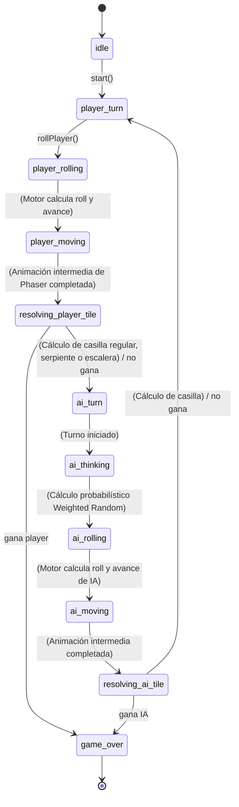

# Máquina de Estados: Serpientes y Escaleras con IA

Este documento describe la máquina de estados del motor de Serpientes y Escaleras con Inteligencia Artificial.

### Relación entre Motor y Animación
- **Motor:** Calcula toda la decisión y el estado futuro instantáneamente al invocar el método de tirar el dado o turno de IA. Realiza validación de `Weighted Random` para decidir el riesgo de la IA de forma aislada y pura.
- **Animación (Phaser):** Recibe el estado inicial y el destino, y anima secuencialmente el movimiento recorriendo las casillas intermedias (derivadas del roll). Al finalizar el recorrido a la casilla intermedia, si hay una serpiente o escalera, realiza una interpolación adicional (jump) al destino final. Al terminar, el motor permite al siguiente turno iniciar.
